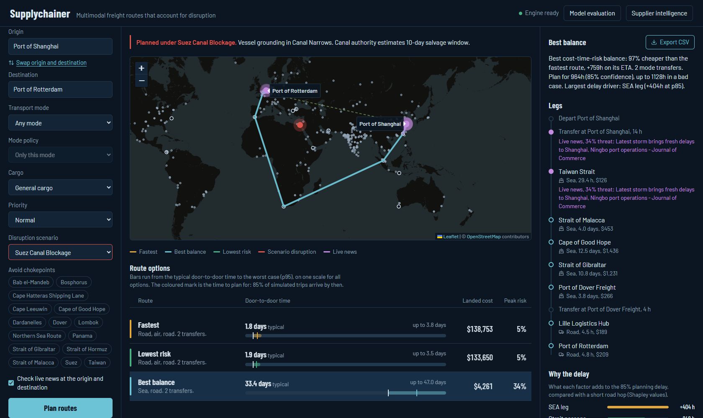
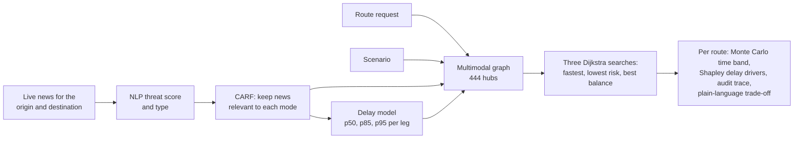

# Supplychainer

Supplychainer plans multimodal freight routes that account for disruption. Give it an origin and a destination anywhere in its network of 444 ports, airports, rail terminals and road hubs. It returns up to three routes:

- the fastest
- the lowest-risk
- the best balance of cost, time and risk

Each route comes with:

- a door-to-door time band (typical, planning time and worst case) from a trained delay model
- the factors behind the delay
- a cost and risk breakdown that adds up
- the live news that affected it

This is our TatHack '26 preliminary submission for **PS6: Supplychainer**. It builds on the organisers' starter repository, [TatHack-Tathva/Supply-chainer](https://github.com/TatHack-Tathva/Supply-chainer). [What we changed](#what-we-changed) lists our work, and the git history shows every step from the starter commit `8f15416`.



## Contents

- [What we changed](#what-we-changed)
- [Run it](#run-it)
- [How it works](#how-it-works)
- [API](#api)
- [Tests](#tests)
- [Project layout](#project-layout)
- [Limitations](#limitations)
- [Team](#team)
- [AI usage](#ai-usage)
- [Credits and licences](#credits-and-licences)

## What we changed

### Fixed: 24 bugs, each with a regression test

The starter code ran without errors but gave wrong answers. Some examples, all measured on the starter commit and on ours:

| Check | Starter | Now |
|---|---|---|
| NLP score for "Container ship ran aground in the Suez Canal, blocking all traffic" | 0.00 | 0.96 |
| Ports that can reach each other by sea | 32 of 175 | every seaport except the 2 landlocked Caspian ports |
| `SUEZ_BLOCK`, Shanghai to Rotterdam | waits at the blocked canal (+240 h) | sails around the Cape of Good Hope |
| `LA_PORT_STRIKE`, Shanghai to Los Angeles | no effect: LA and Long Beach had no shipping lanes | diverts via Oakland and trucks south |
| Explanation text | "reduces total landed cost by 396%" | real comparisons against the other routes returned |
| Start-up warm-up | over 5 minutes | about 7 seconds |

[docs/BUGFIXES.md](docs/BUGFIXES.md) lists each bug with its root cause, its fix and the test that guards it.

### Built

- **A delay model that the router actually uses.** The starter's p85 model was keyed on 16 hub names that don't exist in the routing graph, and it was never called. We replaced it with p50, p85 and p95 quantile models trained on legs sampled from the live graph.
  - Each route option plans on its own quantile.
  - Each route's time band comes from a 4,000-sample Monte Carlo simulation with correlated legs.
  - Exact Shapley values explain what drives the delay.
  - The model gets 87–90% of the improvement over a naive baseline that the best possible model could get. We computed that optimum exactly from the known data generator.
  - A model evaluation page shows calibration, coverage by mode, loss against the naive baseline and the optimum, and feature importance.
  - See [docs/MODEL_CARD.md](docs/MODEL_CARD.md).
- **Threat intelligence that works, and is measured.**
  - Each headline is embedded with bge-small-en-v1.5 and compared with anchors for disruptions and for routine news. The anchors contain no place names.
  - Each threat gets a type: weather, labour, geopolitical, infrastructure, cyber or congestion.
  - The context filter (CARF) checks all four transport modes.
  - Live Google News reports for the origin and destination feed both the threat and the delay model.
  - We scored it on 192 labelled headlines, tuning only on half and testing on the other half. On the test half it went from 70% to 91% of disruptions caught, 22% to 2% false alarms, and AUC 0.83 to 0.99. Threat typing stayed at 85%. `python ml/evaluate_nlp.py` reproduces this.
- **A network that respects geography.**
  - Ships pass through the real straits: Hormuz, Bab el-Mandeb, Suez, Gibraltar, the Turkish Straits, Panama, Malacca and Lombok, or go around the Cape.
  - Road and rail stay on one landmass.
  - Britain connects to the continent only through the Channel Tunnel.
  - 13 major ports that had no shipping lanes are connected.
- **A dashboard for planners.**
  - An interactive map with disruption and live-news markers.
  - Route options side by side on one time scale.
  - A voyage plan for the selected route: legs, delay drivers, and time, cost and risk ledgers.
  - Export the selected route to CSV.
  - Recent plans are remembered, and choosing a scenario lists the recent plans it disrupts.
  - The layout works on phones, controls are labelled, and animation respects reduced motion.
- **Security.**
  - Strict request validation.
  - Per-client rate limiting.
  - An optional API key that stays on the server.
  - CORS and WebSocket origin checks, and security headers.
  - The model file's SHA-256 is pinned in code. See [SECURITY.md](SECURITY.md).
- **Tests.**
  - 227 pytest tests. The starter had none.
  - A Playwright browser test drives the whole dashboard.

## Run it

You need Python 3.11 and Node.js 18 or newer (we use Node 24). The first start needs internet access to download the sentence-transformer model (bge-small-en-v1.5, about 130 MB); after that it loads from the local cache. The map tiles and live news also need internet. Without it, routing still works on the model and the fallback reports.

### 1. Backend

Run these from the repository root, not from `backend/`.

Windows (PowerShell):

```powershell
python -m venv venv
venv\Scripts\Activate.ps1
pip install -r requirements.txt
uvicorn backend.main:app --port 8000
```

If PowerShell refuses to run `Activate.ps1`, run `Set-ExecutionPolicy -Scope Process Bypass` first. If `pip` fails with "The filename or extension is too long", clone the repository to a shorter path such as `C:\src`; one file inside setuptools passes Windows' 260-character path limit when the folder is nested deeply.

macOS and Linux:

```bash
python3 -m venv venv
source venv/bin/activate
pip install -r requirements.txt
uvicorn backend.main:app --port 8000
```

The API is ready when the log shows `Application startup complete`. The news model then warms up in the background for about 7 seconds; the dashboard shows "Engine ready" when it's done. API docs are at http://127.0.0.1:8000/docs.

### 2. Dashboard

In a second terminal:

```bash
cd frontend
npm ci
npm run dev
```

Open http://localhost:5173. To try it:

1. Choose Shanghai as the origin and Rotterdam as the destination, then click **Plan routes**.
2. Change the disruption scenario to **Suez Canal Blockage**. The alert lists your plan as disrupted.
3. Click the plan in the alert to plan it again under the blockage.

### Settings

All settings are optional environment variables.

| Variable | Default | Effect |
|---|---|---|
| `SUPPLYCHAINER_API_KEY` | not set (API open) | Requires an `X-API-Key` header on `POST /api/recommend` and `POST /api/suppliers`. Set it for both the backend and `npm run dev`; the dev server adds the key to proxied requests, so it never reaches the browser. |
| `RATE_LIMIT_PER_MINUTE` | `60` | Compute requests allowed per client address per minute |
| `CORS_ORIGINS` | `http://localhost:5173,http://127.0.0.1:5173` | Browser origins allowed to call the API |
| `DEMO_MODE` | `false` | `true` skips the news-model warm-up. Routing still works; live news is not scored. |

To set a variable for one session: `$env:SUPPLYCHAINER_API_KEY = "choose-a-key"` in PowerShell, or `export SUPPLYCHAINER_API_KEY=choose-a-key` in bash.

## How it works



1. **Graph.** Every hub has one node per transport mode it serves. Moving between modes at a hub is a transfer leg with its own time and cost. Sea lanes between basins pass through the straits that connect them.
2. **Scenario.** A disruption scenario marks hubs as disrupted. A route touching one is exposed to its threat, and is charged its delay and a 10% risk premium once per route. Scenarios are looked up per request, so concurrent users never see each other's.
3. **Live news** (optional).
   - Headlines for the origin and destination cities come from Google News RSS. Each fetch gets 2 seconds and the whole lookup 3 seconds; results are cached for 15 minutes.
   - Each headline is scored separately, and the strongest one sets the threat and its type.
   - CARF drops a report for a leg when the report is about another mode's infrastructure.
   - Weather reports also set the weather feature for the delay model.
4. **Delay model.** Predicts each leg's p50, p85 and p95 delay from mode, distance, arrival type (terminal, canal or strait), weather and news score. The model is monotonic, so more distance, worse weather or stronger news never lowers a prediction.
5. **Search.** Dijkstra runs three times:
   - The fastest option plans on each leg's p50 time.
   - The lowest-risk option plans on p95 time, weighted by threat.
   - The best balance weighs time, cost and risk according to the shipment's priority.

   Options that choose the same path are merged.
6. **Reporting.** Each route gets:
   - a door-to-door time band simulated from its legs
   - the Shapley breakdown of its p85 delay
   - an audit trace whose parts add up exactly to the totals
   - an explanation that compares it with the other options

## API

| Method | Path | Purpose |
|---|---|---|
| `POST` | `/api/recommend` | Route options for one shipment |
| `POST` | `/api/suppliers` | Suppliers ranked under a scenario, with procurement advice |
| `GET` | `/api/hubs`, `/api/hubs/search?q=` | Hub registry and search |
| `GET` | `/api/scenarios` | Disruption scenarios |
| `GET` | `/api/network`, `/api/cities` | Graph and city-to-hub lookup |
| `GET` | `/api/model` | Held-out evaluation of the delay model |
| `GET` | `/api/status`, `WS /ws` | Engine status |

Example request:

```json
POST /api/recommend
{
  "source": "Shanghai",
  "destination": "Rotterdam",
  "transport_preference": "sea",
  "routing_policy": "STRICT",
  "cargo_type": "general",
  "priority": "normal",
  "scenario": "SUEZ_BLOCK",
  "live_intel": false,
  "overrides": { "avoid_chokepoints": ["CHOKE-MALACCA"] }
}
```

Other accepted values:

- `transport_preference`: `any`, `sea`, `air`, `rail` or `road`
- `routing_policy`: `STRICT` or `PREFERRED`
- `cargo_type`: `general`, `perishable_urgent`, `hazardous_waste` or `oversize_heavy`
- `priority`: `low`, `normal` or `urgent`

Unknown fields, scenarios and hub IDs are rejected.

The response below is shortened from a real run of the same request without the `overrides`:

```json
{
  "origin": "Shanghai",
  "destination": "Rotterdam",
  "active_scenario": "Suez Canal Blockage",
  "delay_model": true,
  "live_intel": [],
  "recommendations": [
    {
      "personas": ["FASTEST", "BALANCED"],
      "adjusted_eta": 795.9,
      "eta_band": { "p50": 810.4, "p85": 961.9, "p95": 1126.9 },
      "total_cost": 3883.89,
      "threat_level": 0.2,
      "legs": [
        { "to_name": "Strait of Malacca", "mode": "SEA", "type": "transit", "eta": 119.4,
          "delay": { "p50": 10.6, "p85": 26.8, "p95": 55.7 }, "intel_source": "FALLBACK" }
      ],
      "delay_drivers": {
        "quantile": "p85", "reference_hours": 19.8, "total_hours": 270.6,
        "drivers": [ { "factor": "SEA leg", "hours": 327.2 }, { "factor": "Strait passage", "hours": -146.2 } ]
      },
      "audit_trace": {
        "eta": { "transit": 672.22, "transfer": 18.0, "delay": 105.63, "scenario": 0.0 },
        "cost": { "transit": 3533.89, "transfer": 350.0, "scenario": 0.0 },
        "risk": { "baseline": 0.2, "scenario": 0.0, "live": 0.0 }
      },
      "explanation": "Fastest option: 796h door to door, 9h sooner than the safest route at 0.9x its cost. ..."
    }
  ]
}
```

All times are in hours and costs in US dollars.

## Tests

```bash
python -m pip install -r requirements-dev.txt
python -m pytest                     # 227 tests, about a minute
python tools/audit_land_lanes.py     # lists road and rail lanes whose straight line crosses water
```

The audit lists coastal lanes that cut across a bay, too. Lanes between landmasses with no bridge or tunnel are prevented in code and covered by `test_impossible_land_lanes_are_absent`.

The browser test needs the backend and the dashboard running:

```bash
python tools/ui_smoke.py             # uses Microsoft Edge; add --browser chrome for Chrome
```

It plans a route, re-plans it from the scenario alert, checks the voyage plan and the CSV export, opens the other two pages and replays a recent plan at phone width. It fails on any console error or failed request, and saves screenshots to `ui-screens/`.

## Project layout

| Path | What it is |
|---|---|
| `backend/main.py` | FastAPI app: endpoints, request validation, security middleware |
| `backend/security.py` | Rate limiter, API key, allowed origins, headers |
| `backend/engine/route_recommender.py` | Routing, reporting and explanations |
| `backend/engine/multimodal_network.py` | Builds the graph: basins, straits, landmasses, transfers |
| `backend/engine/delay_model.py`, `delay_features.py` | Loads the pinned delay model; features and Shapley values |
| `backend/engine/threat_intelligence.py` | NLP threat scoring and type, CARF |
| `backend/engine/news_ingestion.py` | Google News RSS with time limits and caching |
| `backend/engine/scenario_manager.py`, `supplier_scorer.py`, `node_resolver.py` | Scenarios, supplier ranking, place-name lookup |
| `backend/data/` | Hub registry, city lookup, suppliers |
| `ml/` | Dataset generator and training script for the delay model |
| `Execution/delay_quantile_model.joblib` and `.json` | Trained delay model and its evaluation report |
| `frontend/src/` | React dashboard: route planner, map, model evaluation, suppliers |
| `tests/`, `tools/` | Test suite, land-lane audit, browser smoke test |
| `docs/` | Bug fixes, model card, screenshots |

Some starter files are not used by the app. We kept them for reference:

- `Execution/api.py`, `risk_model.pkl`, `label_encoders.pkl` and `nlp_anchors.pt`: the original prototype API and its model files. The app never loads them.
- In `backend/engine/`: `baseline.py`, `graph_model.py`, `simulator.py`, `optimizer.py`, `evaluator.py`, `benchmark_runner.py`, `or_baseline.py`, `weather_integration.py`, `live_routing.py` and `ml_predictor.py`. They belong to an earlier US-only prototype.
- `Code/`, `scratch/` and `benchmarks/`: the original author's data-generation and audit scripts.
- `docs/starter-notes/`: the original author's audit notes. They describe the starter code, and several of their claims no longer hold. The bug log and model card have the current numbers.

## Limitations

- **The delay model is trained on synthetic data.** There is no public dataset of per-leg freight delays. The generator uses physics-informed priors, and the model card lists them.
- **Costs and nominal times come from the hub registry,** not live freight rates or schedules.
- **Live news covers only the origin and destination cities.** The source is English Google News RSS. Hubs along the way use scenarios and standing reports.
- **Nothing is stored on the server.** Recent plans are kept in the browser that made them.
- **Map tiles come from the public OpenStreetMap servers,** whose usage policy suits a demo but not heavy use.

## Team

- [Trafalgar-2006](https://github.com/Trafalgar-2006) (Mohith Akshay Duggirala)
- [samdoglover](https://github.com/samdoglover)

## AI usage

We used **Claude Code** (Anthropic's coding assistant) throughout, as the TatHack rules allow. It helped us with:

- reading the starter code and finding bugs
- writing fixes and regression tests
- building the delay-model pipeline and wiring it into routing
- the network geography
- security hardening
- redesigning the dashboard
- writing documentation

Commits it helped write carry a `Co-Authored-By: Claude` trailer. We reviewed and ran every change, checked the numbers against real scenarios, and can explain and modify every part of the code.

At runtime the app uses one pretrained model, BAAI/bge-small-en-v1.5. It turns text into vectors for threat scoring and doesn't generate anything. The demo video is a screen recording of this code running.

## Credits and licences

This project is released under the Apache License 2.0 (see [LICENSE](LICENSE)), the same licence as the starter repository.

| Dependency | Licence |
|---|---|
| FastAPI, pydantic | MIT |
| Uvicorn, NetworkX, scikit-learn, NumPy, pandas, SciPy, joblib, PyTorch | BSD-3-Clause |
| sentence-transformers, Hugging Face transformers, requests | Apache-2.0 |
| feedparser | BSD-2-Clause |
| bge-small-en-v1.5 (BAAI) | MIT |
| React, Vite, recharts, anime.js | MIT |
| Leaflet | BSD-2-Clause |
| lucide-react | ISC |
| Barlow and Barlow Condensed fonts (Google Fonts) | SIL Open Font License 1.1 |
| pytest, global-land-mask | MIT |
| Playwright, pip-audit | Apache-2.0 |

- **Map data:** © OpenStreetMap contributors, available under the Open Database License. The map shows this attribution.
- **Live headlines:** Google News RSS. The dashboard shows each headline with its publisher.
